<div align="center">



<br/>

<a href="https://www.linkedin.com/in/mustapha-lamhamdi-alaoui-1b905a1b7/"></a>
&nbsp;<a href="mailto:mustapha11lamhamdi11@gmail.com"></a>
&nbsp;<a href="https://twitter.com/mustaphalamham8"></a>

</div>

<br/>

Software engineer in Rabat, Morocco. I build full-stack web applications and desktop tools — and I believe restraint is a feature. Every pixel on this page is placed on purpose.

```
stack     java · javafx · typescript · javascript · php · mysql
tools     git · linux · vs code · intellij idea
now       building, learning, shipping
```

<br/>

## ♟️ Play chess on my profile

The board below is a real, live chess game. Anyone reading this can make the next move — your move becomes a commit, your name enters the hall of fame. Yes, this README is playable.

<!-- CHESS-START -->

<div align="center">


</div>

**It's White ♙ to move.** Anyone can play — pick a move below, an issue opens pre-filled, press *Create*, wait ~30s, refresh this page. Your move is on the board and your name is in the hall of fame.

| Piece | Available moves |
|:---:|:---|
| ♙ a3 | [a4](https://github.com/Mustaphalamhamdi/Mustaphalamhamdi/issues/new?title=chess%7Cmove%7Ca3a4&body=Just%20press%20'Create'%20below%20%E2%80%94%20the%20bot%20plays%20your%20move%20within%20~30%20seconds.%20Then%20go%20back%20to%20the%20profile%20and%20refresh!) |
| ♙ b2 | [b3](https://github.com/Mustaphalamhamdi/Mustaphalamhamdi/issues/new?title=chess%7Cmove%7Cb2b3&body=Just%20press%20'Create'%20below%20%E2%80%94%20the%20bot%20plays%20your%20move%20within%20~30%20seconds.%20Then%20go%20back%20to%20the%20profile%20and%20refresh!) · [b4](https://github.com/Mustaphalamhamdi/Mustaphalamhamdi/issues/new?title=chess%7Cmove%7Cb2b4&body=Just%20press%20'Create'%20below%20%E2%80%94%20the%20bot%20plays%20your%20move%20within%20~30%20seconds.%20Then%20go%20back%20to%20the%20profile%20and%20refresh!) |
| ♙ c2 | [c3](https://github.com/Mustaphalamhamdi/Mustaphalamhamdi/issues/new?title=chess%7Cmove%7Cc2c3&body=Just%20press%20'Create'%20below%20%E2%80%94%20the%20bot%20plays%20your%20move%20within%20~30%20seconds.%20Then%20go%20back%20to%20the%20profile%20and%20refresh!) · [c4](https://github.com/Mustaphalamhamdi/Mustaphalamhamdi/issues/new?title=chess%7Cmove%7Cc2c4&body=Just%20press%20'Create'%20below%20%E2%80%94%20the%20bot%20plays%20your%20move%20within%20~30%20seconds.%20Then%20go%20back%20to%20the%20profile%20and%20refresh!) |
| ♙ d2 | [d3](https://github.com/Mustaphalamhamdi/Mustaphalamhamdi/issues/new?title=chess%7Cmove%7Cd2d3&body=Just%20press%20'Create'%20below%20%E2%80%94%20the%20bot%20plays%20your%20move%20within%20~30%20seconds.%20Then%20go%20back%20to%20the%20profile%20and%20refresh!) · [d4](https://github.com/Mustaphalamhamdi/Mustaphalamhamdi/issues/new?title=chess%7Cmove%7Cd2d4&body=Just%20press%20'Create'%20below%20%E2%80%94%20the%20bot%20plays%20your%20move%20within%20~30%20seconds.%20Then%20go%20back%20to%20the%20profile%20and%20refresh!) |
| ♙ e2 | [e3](https://github.com/Mustaphalamhamdi/Mustaphalamhamdi/issues/new?title=chess%7Cmove%7Ce2e3&body=Just%20press%20'Create'%20below%20%E2%80%94%20the%20bot%20plays%20your%20move%20within%20~30%20seconds.%20Then%20go%20back%20to%20the%20profile%20and%20refresh!) · [e4](https://github.com/Mustaphalamhamdi/Mustaphalamhamdi/issues/new?title=chess%7Cmove%7Ce2e4&body=Just%20press%20'Create'%20below%20%E2%80%94%20the%20bot%20plays%20your%20move%20within%20~30%20seconds.%20Then%20go%20back%20to%20the%20profile%20and%20refresh!) |
| ♙ f2 | [f3](https://github.com/Mustaphalamhamdi/Mustaphalamhamdi/issues/new?title=chess%7Cmove%7Cf2f3&body=Just%20press%20'Create'%20below%20%E2%80%94%20the%20bot%20plays%20your%20move%20within%20~30%20seconds.%20Then%20go%20back%20to%20the%20profile%20and%20refresh!) · [f4](https://github.com/Mustaphalamhamdi/Mustaphalamhamdi/issues/new?title=chess%7Cmove%7Cf2f4&body=Just%20press%20'Create'%20below%20%E2%80%94%20the%20bot%20plays%20your%20move%20within%20~30%20seconds.%20Then%20go%20back%20to%20the%20profile%20and%20refresh!) |
| ♙ g2 | [g3](https://github.com/Mustaphalamhamdi/Mustaphalamhamdi/issues/new?title=chess%7Cmove%7Cg2g3&body=Just%20press%20'Create'%20below%20%E2%80%94%20the%20bot%20plays%20your%20move%20within%20~30%20seconds.%20Then%20go%20back%20to%20the%20profile%20and%20refresh!) · [g4](https://github.com/Mustaphalamhamdi/Mustaphalamhamdi/issues/new?title=chess%7Cmove%7Cg2g4&body=Just%20press%20'Create'%20below%20%E2%80%94%20the%20bot%20plays%20your%20move%20within%20~30%20seconds.%20Then%20go%20back%20to%20the%20profile%20and%20refresh!) |
| ♙ h2 | [h3](https://github.com/Mustaphalamhamdi/Mustaphalamhamdi/issues/new?title=chess%7Cmove%7Ch2h3&body=Just%20press%20'Create'%20below%20%E2%80%94%20the%20bot%20plays%20your%20move%20within%20~30%20seconds.%20Then%20go%20back%20to%20the%20profile%20and%20refresh!) · [h4](https://github.com/Mustaphalamhamdi/Mustaphalamhamdi/issues/new?title=chess%7Cmove%7Ch2h4&body=Just%20press%20'Create'%20below%20%E2%80%94%20the%20bot%20plays%20your%20move%20within%20~30%20seconds.%20Then%20go%20back%20to%20the%20profile%20and%20refresh!) |
| ♖ a1 | [Ra2](https://github.com/Mustaphalamhamdi/Mustaphalamhamdi/issues/new?title=chess%7Cmove%7Ca1a2&body=Just%20press%20'Create'%20below%20%E2%80%94%20the%20bot%20plays%20your%20move%20within%20~30%20seconds.%20Then%20go%20back%20to%20the%20profile%20and%20refresh!) |
| ♘ b1 | [Nc3](https://github.com/Mustaphalamhamdi/Mustaphalamhamdi/issues/new?title=chess%7Cmove%7Cb1c3&body=Just%20press%20'Create'%20below%20%E2%80%94%20the%20bot%20plays%20your%20move%20within%20~30%20seconds.%20Then%20go%20back%20to%20the%20profile%20and%20refresh!) |
| ♘ g1 | [Nf3](https://github.com/Mustaphalamhamdi/Mustaphalamhamdi/issues/new?title=chess%7Cmove%7Cg1f3&body=Just%20press%20'Create'%20below%20%E2%80%94%20the%20bot%20plays%20your%20move%20within%20~30%20seconds.%20Then%20go%20back%20to%20the%20profile%20and%20refresh!) · [Nh3](https://github.com/Mustaphalamhamdi/Mustaphalamhamdi/issues/new?title=chess%7Cmove%7Cg1h3&body=Just%20press%20'Create'%20below%20%E2%80%94%20the%20bot%20plays%20your%20move%20within%20~30%20seconds.%20Then%20go%20back%20to%20the%20profile%20and%20refresh!) |

**Recent moves**

- `Nc6` by [@Mustaphalamhamdi](https://github.com/Mustaphalamhamdi)
- `a3` by [@Mustaphalamhamdi](https://github.com/Mustaphalamhamdi)

**Hall of fame** (most moves played)

🥇 [@Mustaphalamhamdi](https://github.com/Mustaphalamhamdi) — 2 moves

*Games completed on this board: 0. Powered by GitHub issues + Actions — no server, no magic, just ♟.*

<!-- CHESS-END -->

<br/>

## Selected work

| Project | What it is | Built with |
|:---|:---|:---|
| [RevisIA](https://github.com/Mustaphalamhamdi/RevisIA) | AI-assisted revision desktop app | JavaFX |
| [Used Products Marketplace](https://github.com/Mustaphalamhamdi/usedProductsMartketPlace) | Full-stack second-hand marketplace | PHP · MySQL |
| [IsmagiLearningApp](https://github.com/Mustaphalamhamdi/IsmagiLearningApp) | E-learning platform | JavaScript |
| [Password Manager](https://github.com/Mustaphalamhamdi/Password-Manager) | Secure credentials vault | TypeScript |

<br/>

## The snake

One more small indulgence — my contribution graph, being eaten.

<div align="center">

<picture>
  <source media="(prefers-color-scheme: dark)" srcset="https://raw.githubusercontent.com/Mustaphalamhamdi/Mustaphalamhamdi/output/github-snake-dark.svg"/>
  <source media="(prefers-color-scheme: light)" srcset="https://raw.githubusercontent.com/Mustaphalamhamdi/Mustaphalamhamdi/output/github-snake.svg"/>
  
</picture>

</div>

<br/>

## Numbers

<div align="center">


</div>

<br/>

<div align="center">

<sub>first, solve the problem. then, write the code.</sub>

</div>
