<div align="center">

<!-- CUSTOM ANIMATED HERO (hosted in this repo) -->


<br/><br/>

<!-- LIVE TERMINAL -->


<br/><br/>

<a href="https://www.linkedin.com/in/mustapha-lamhamdi-alaoui-1b905a1b7/"></a>
&nbsp;
<a href="mailto:mustapha11lamhamdi11@gmail.com"></a>
&nbsp;
<a href="https://twitter.com/mustaphalamham8"></a>
&nbsp;


</div>

<br/>

##  About Me

```typescript
type Engineer = {
  name: string;
  location: string;
  mission: string;
  stack: string[];
};

const mustapha: Engineer = {
  name: "Mustapha Lamhamdi Alaoui",
  location: "Rabat, Morocco 🇲🇦",
  mission: "Turning ideas into shipped products",
  stack: ["Java/JavaFX", "TypeScript", "JavaScript", "PHP", "MySQL"],
};
```

## ⚡ Tech Stack

<div align="center">


</div>

## 🐍 Watch My Contributions Get Eaten

<div align="center">

<picture>
  <source media="(prefers-color-scheme: dark)" srcset="https://raw.githubusercontent.com/Mustaphalamhamdi/Mustaphalamhamdi/output/github-snake-dark.svg"/>
  <source media="(prefers-color-scheme: light)" srcset="https://raw.githubusercontent.com/Mustaphalamhamdi/Mustaphalamhamdi/output/github-snake.svg"/>
  
</picture>

</div>

## 🚀 Featured Projects

<table align="center">
<tr>
<td width="50%" valign="top">

### 🧠 RevisIA
**AI-assisted revision desktop app**

Desktop application built with JavaFX that helps students revise smarter.


[View Repo →](https://github.com/Mustaphalamhamdi/RevisIA)

</td>
<td width="50%" valign="top">

### 🛒 Used Products Marketplace
**Full-stack second-hand marketplace**

Buy & sell platform with listings, auth, and a PHP/MySQL backend.


[View Repo →](https://github.com/Mustaphalamhamdi/usedProductsMartketPlace)

</td>
</tr>
<tr>
<td width="50%" valign="top">

### 📚 IsmagiLearningApp
**E-learning platform**

Web platform for online learning, built with JavaScript.


[View Repo →](https://github.com/Mustaphalamhamdi/IsmagiLearningApp)

</td>
<td width="50%" valign="top">

### 🔐 Password Manager
**Secure credentials vault**

Type-safe password manager built with TypeScript.


[View Repo →](https://github.com/Mustaphalamhamdi/Password-Manager)

</td>
</tr>
</table>

## 📊 Stats

<div align="center">


</div>

<br/>

<div align="center">


</div>
